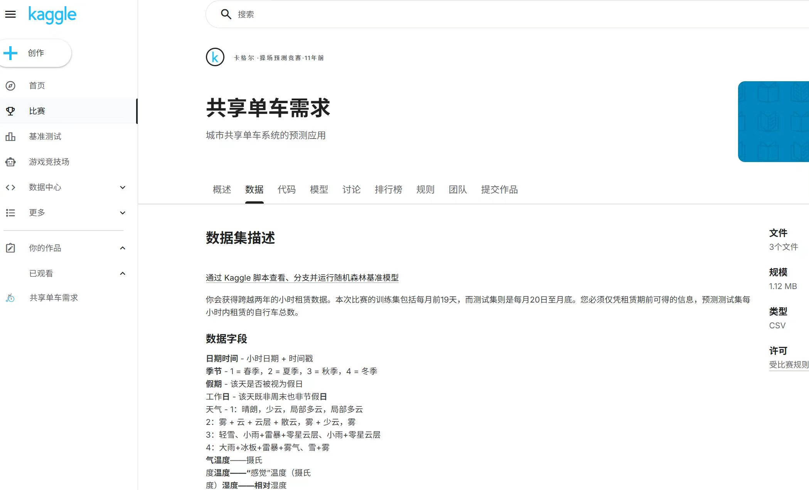
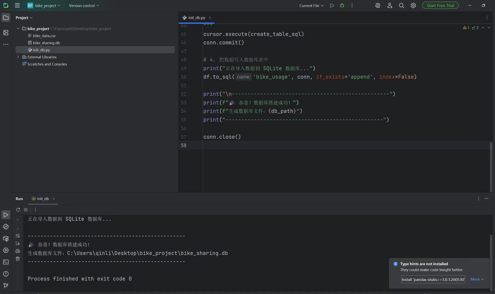
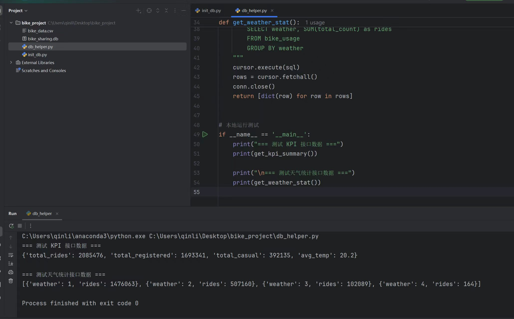

# 项目实施过程证据

本页收录项目实施过程截图，图片均来自本项目实际操作记录；报告中使用时保持图片、编号和文字说明对应。

## 图 1 数据集获取

说明：该截图用于“数据来源与获取”章节。页面展示了共享单车需求数据集及其字段说明，项目据此整理出 `bike_data.csv`，用于数据库导入、后端查询和前端大屏。

## 图 2 SQLite 建库与数据导入

说明：该截图用于“数据库设计与数据导入”章节。导入程序读取 `bike_data.csv`，创建 SQLite 数据库文件并将数据写入 `bike_usage` 表。项目对应代码为 `src/bikeshare_viz/database/init_db.py`。

## 图 3 查询接口测试

说明：该截图用于“后端查询接口与测试”章节。查询接口返回总租车量、注册用户量、临时用户量、平均温度，以及按天气分组的租车量。项目对应代码为 `src/bikeshare_viz/database/db_helper.py`。

## 团队分工说明

团队分工不使用截图作为报告证据，正式内容以 [`team-plan.md`](team-plan.md) 为准。项目按五类职责组织：成员 1 负责项目管理、后端开发与数据库；成员 2 负责数据清洗、分析与指标计算；成员 3 负责前端数据大屏与可视化；成员 4 负责课程报告、质量控制与提交材料；成员 5 负责前沿技术调研、答辩 PPT 和全员交叉讲解。每项职责均已对应到实际源代码、前端文件或文档交付物。
